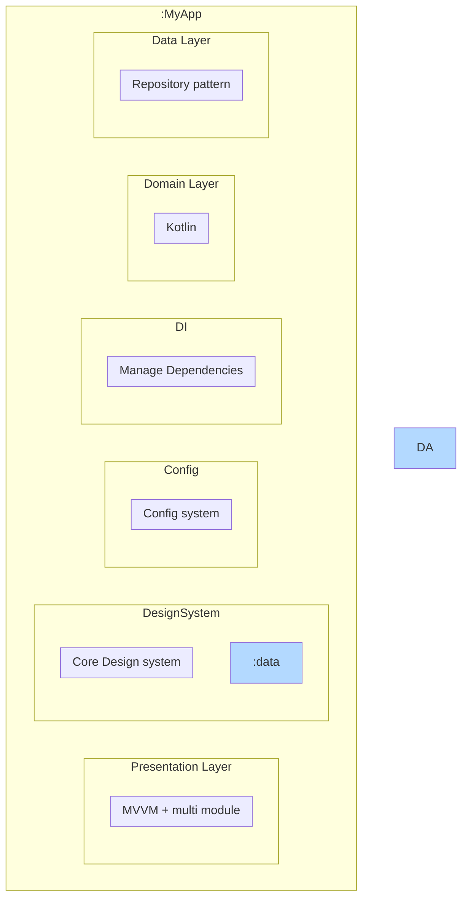

## Architecture

The project follows Clean Architecture principles combined with MVVM pattern, organized into multiple modules:
## Project Structure
├── app/                 # Main application module
│   ├── ui/             # UI Components and ViewModels
│   └── di/             # App level dependency injection
│
├── data/               # Data layer implementation
│   ├── api/            # API Services
│   ├── repository/     # Repository Implementations
│   └── di/             # Data layer DI modules
│
├── domain/             # Business logic and interfaces
│   ├── model/          # Domain Models
│   ├── repository/     # Repository Interfaces
│   └── usecase/        # Use Cases
│
├── designsystem/       # UI Component Library
│   ├── theme/          # App Theme
│   │   ├── Color.kt    # Color Definitions
│   │   ├── Type.kt     # Typography
│   │   └── Shape.kt    # Shapes
│   └── components/     # Reusable UI Components
│
├── config/             # Network Configuration
│   └── NetworkConfig.kt # Base URL and API Constants
│

## Overview Architect

## Overview Flow Of Control
Flow of control apply with coroutine


## Data Flow Example
```
sequenceDiagram
    UI->>ViewModel: Request user list
    ViewModel->>UseCase: fetchUserList()
    UseCase->>Repository: fetchUserList()
    Repository->>API: HTTP Request
    API-->>Repository: Response
    Repository-->>UseCase: Flow<ResultApi>
    UseCase-->>ViewModel: Flow<ResultApi>
    ViewModel-->>UI: Update UI State
```


## Key Features
1. **User List Display**
    - Pagination support
    - Cache mechanism
    - Error handling
2. **User Details**
    - Detailed user information
    - Error state handling
    - Error handling

### Main Layers:

1. **Presentation Layer (UI)**
    - Screens (Composables)
    - ViewModels
    - UI States
    - UI Events

2. **Domain Layer**
    - Use Cases
    - Domain Models
    - Repository Interfaces

3. **Data Layer**
    - Repository Implementations
    - Remote Data Source (API)
    - Local Data Source (Room Database)
    - Data Models (DTOs)

## Tech Stack
- **Jetpack Compose**: Modern UI toolkit
- **Kotlin Coroutines & Flow**: Asynchronous programming
- **Hilt**: Dependency Injection
- **Retrofit**: Network calls
- **Room**: Local database
- **Unit Testing**: JUnit, Mockito
- **Navigation Component**: Navigation

## Main Features

### 1. Home Screen
- Display user list
- Navigation to User Detail
- Load more after scroll
- Click into item to navigation detail screen

### 2. User Detail Screen
- Display user detailed information

## Testing

The project includes:
- ViewModel Unit Tests
- Use Case Unit Tests
- Repository Integration Tests

## Dependency Injection

Using Hilt with main modules:
- NetworkModule
- DatabaseModule
- RepositoryModule

## Getting Started
1. Clone the repository 
2. bash
   git clone https://github.com/your-username/TymexProject.git

3. Open project in Android Studio

4. Sync project with Gradle files

5. Run the app on an emulator or physical device

## System Requirements
- Android Studio : 4.2.2
- Minimum SDK: 24
- Target SDK: 34
- Kotlin version: 1.9.0

## Document:
Clean architect structure https://blog.cleancoder.com/uncle-bob/2012/08/13/the-clean-architecture.html


