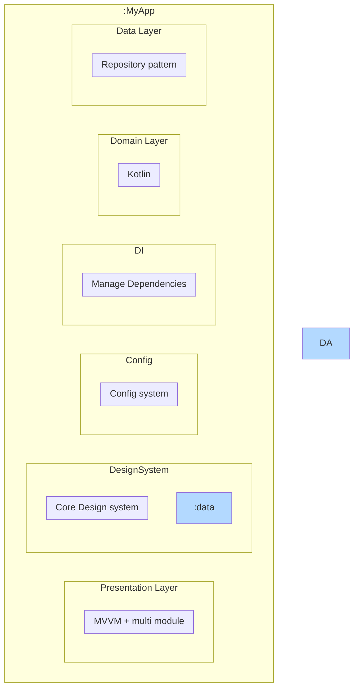

## Architecture

The project follows Clean Architecture principles combined with MVVM pattern, organized into multiple modules:
## Project Structure
![Scre

## Overview Architect

```mermaid
graph TD
    subgraph Application[:MyApp]
        subgraph "Presentation Layer"
            direction TB
            subgraph "MVVM + multi module"
            end
        end

        subgraph "DesignSystem"
            direction TB
            D[":designsystem"]
            style DA fill:#b3d9ff
            subgraph "Core Design system"
            end
        end

        subgraph "Config"
            direction TB
            D[":config"]
            style DA fill:#b3d9ff
            subgraph "Config system"
            end
        end

        subgraph "DI"
            direction TB
            D[":di"]
            style DA fill:#b3d9ff
            subgraph "Manage Dependencies"
            end
        end

        subgraph "Domain Layer"
            direction TB
            D[":domain"]
            style D fill:#b3d9ff
            subgraph "Kotlin"
            end
        end

        subgraph "Data Layer"
            direction TB
            D[":data"]
            style DA fill:#b3d9ff
            subgraph "Repository pattern"
            end
        end
    end
```
## Overview Flow Of Control
Flow of control apply with coroutine

## Flow Description

1. **UI to ViewModel**
   - UI triggers a request to load user list
   - ViewModel receives the request and initiates the data fetch

2. **ViewModel to UseCase**
   - ViewModel calls UseCase's fetchUserList method
   - UseCase handles business logic

3. **UseCase to Repository**
   - UseCase delegates the data fetching to Repository
   - Repository decides data source (API/Cache)

4. **Repository to API**
   - Repository makes HTTP request to API
   - API processes the request

5. **API to Repository**
   - API sends back response
   - Repository processes the response

6. **Repository to UseCase**
   - Repository wraps data in Flow<ResultApi>
   - Handles success/error states

7. **UseCase to ViewModel**
   - UseCase passes Flow<ResultApi> to ViewModel
   - ViewModel can process the data if needed

8. **ViewModel to UI**
   - ViewModel updates UI state
   - UI reflects the changes

## Key Features
1. **User List Display**
    - Pagination support
    - Cache mechanism
    - Error handling
2. **User Details**
    - Detailed user information
    - Error state handling
    - Error handling

### Main Layers:

1. **Presentation Layer (UI)**
    - Screens (Composables)
    - ViewModels
    - UI States
    - UI Events

2. **Domain Layer**
    - Use Cases
    - Domain Models
    - Repository Interfaces

3. **Data Layer**
    - Repository Implementations
    - Remote Data Source (API)
    - Local Data Source (Room Database)
    - Data Models (DTOs)

## Tech Stack
- **Jetpack Compose**: Modern UI toolkit
- **Kotlin Coroutines & Flow**: Asynchronous programming
- **Hilt**: Dependency Injection
- **Retrofit**: Network calls
- **Room**: Local database
- **Unit Testing**: JUnit, Mockito
- **Navigation Component**: Navigation

## Main Features

### 1. Home Screen
- Display user list
- Navigation to User Detail
- Load more after scroll
- Click into item to navigation detail screen

### 2. User Detail Screen
- Display user detailed information

## Testing

The project includes:
- ViewModel Unit Tests
- Use Case Unit Tests
- Repository Integration Tests

## Dependency Injection

Using Hilt with main modules:
- NetworkModule
- DatabaseModule
- RepositoryModule

## Getting Started
1. Clone the repository 
2. bash
   git clone https://github.com/your-username/TymexProject.git

3. Open project in Android Studio

4. Sync project with Gradle files

5. Run the app on an emulator or physical device

## System Requirements
- Android Studio : 4.2.2
- Minimum SDK: 24
- Target SDK: 34
- Kotlin version: 1.9.0

## Document:
Clean architect structure https://blog.cleancoder.com/uncle-bob/2012/08/13/the-clean-architecture.html

