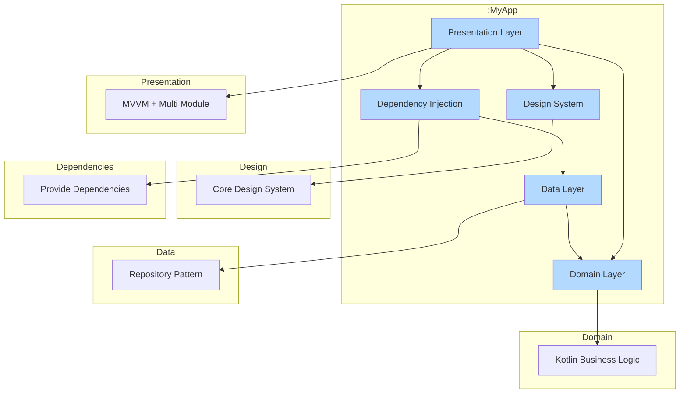

## Architecture

The project follows Clean Architecture principles combined with MVVM pattern:
Document:
Clean architect structure https://blog.cleancoder.com/uncle-bob/2012/08/13/the-clean-architecture.html

### Main Layers:

1. **Presentation Layer (UI)**
    - Screens (Composables)
    - ViewModels
    - UI States
    - UI Events

2. **Domain Layer**
    - Use Cases
    - Domain Models
    - Repository Interfaces

3. **Data Layer**
    - Repository Implementations
    - Remote Data Source (API)
    - Local Data Source (Room Database)
    - Data Models (DTOs)

## Tech Stack

- **Jetpack Compose**: Modern UI toolkit
- **Kotlin Coroutines & Flow**: Asynchronous programming
- **Hilt**: Dependency Injection
- **Retrofit**: Network calls
- **Room**: Local database
- **Unit Testing**: JUnit, Mockito
- **Navigation Component**: Navigation

## Main Features

### 1. Home Screen
- Display user list
- Navigation to User Detail
- Load more after scroll
- Click into item to navigation detail screen

### 2. User Detail Screen
- Display user detailed information

## Testing

The project includes:
- ViewModel Unit Tests
- Use Case Unit Tests
- Repository Integration Tests

## Dependency Injection

Using Hilt with main modules:
- NetworkModule
- DatabaseModule
- RepositoryModule

## Getting Started
1. Clone the repository 
2. bash
   git clone https://github.com/your-username/TymexProject.git

3. Open project in Android Studio

4. Sync project with Gradle files

5. Run the app on an emulator or physical device

## System Requirements
- Android Studio : 4.2.2
- Minimum SDK: 24
- Target SDK: 34
- Kotlin version: 1.9.0

## Overview Flow

Flow of control apply with coroutine

